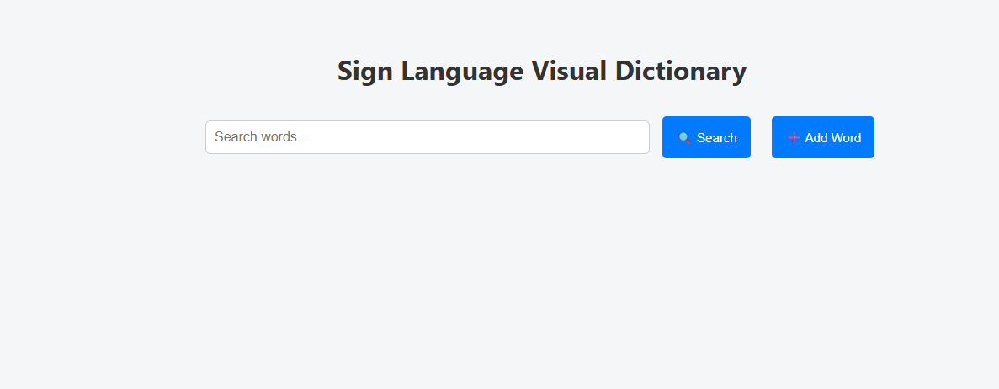

# Mini Sign Language Visual Dictionary

A simple MERN stack application to search, add, edit, and delete sign language words with definitions, images, and videos.

## Features
Home Page with Search Bar

## Demo Video

Search by word

Add new word (word, definition, image URL, video URL)

Edit existing word

Delete word

# Setup

git clone 

cd Msl_Viusal_Dictionary

cd backend

npm install

Update your Mongo_Uri in .env

MONGO_URI=your_mongodb_connection_string

PORT=5000

npm start

cd client
npm install

npm run dev
